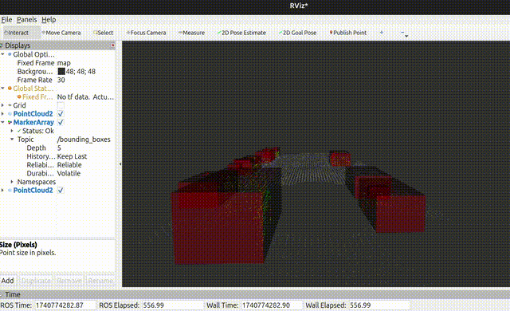

# Object Detection Using LiDAR

## Overview
This project processes LiDAR point cloud data using the **Point Cloud Library (PCL)** to detect and classify objects. The pipeline employs:
- **Custom RANSAC** for planar segmentation
- **KD-Tree clustering algorithm** for object grouping and identification

The method enables efficient object recognition and spatial analysis, enhancing navigation and environment mapping. The project is developed in **C++** within a **ROS 2 (Jazzy) environment** and visualized using **RViz**.

## Repository Structure
```
Object-Detection-Using-LiDAR/
│── data/pcd/
│   │── data_1/                            # PCD files dataset 1 (highway only cars and trucks)
│   │── data_2/                            # PCD files dataset 2 (highway cars, trucks, bicycles, etc)
│── src/lidar_object_detection/
│   │── include/lidar_object_detection/    # Header files
│   │── src/                               # Source files
│── videos/
│   │── output_lidar_video.gif             # Result Gif (with PCD data_1)
│── CMakeLists.txt                         # CMake build configuration
│── package.xml                            # ROS 2 package metadata
│── README.md                              # Project documentation
```

## Dependencies
Ensure you have the following dependencies installed:
- **ROS 2 Jazzy (Robot Operating System 2)**
- **Point Cloud Library (PCL)**
- **C++ (CMake build system)**
- **RViz** (for visualization)

## Installation & Compilation
Clone the repository into your ROS 2 workspace:
```sh
cd ~/ros2_ws/src
git clone https://github.com/your-repo/Object-Detection-Using-LiDAR.git
cd ..
colcon build
source install/setup.bash
```

## Running the Node
Run the ROS 2 node to process LiDAR data:
```sh
ros2 run lidar_object_detection lidar_detection_node
```

## Visualization
Use **RViz** to visualize the detected objects and clustering results. Ensure RViz is installed and configured correctly to subscribe to the necessary LiDAR topics.

## Results
A GIF demonstrating the detection and classification of objects in a 3D environment using **RANSAC segmentation** and **KD-Tree clustering** is available below:




